# 2. Arquitectura del Sistema

La aplicación "LocalizaBaño" está diseñada siguiendo una arquitectura de tres capas, un modelo estándar en el desarrollo de aplicaciones web modernas. Este enfoque desacopla la lógica de presentación, la lógica de negocio y el almacenamiento de datos, lo que resulta en un sistema más modular, escalable y fácil de mantener.

Las tres capas principales son:

1.  **Capa de Presentación (Frontend):** Es la interfaz con la que interactúa el usuario. Está construida como una Aplicación de Página Única (SPA) utilizando HTML5, CSS3 y JavaScript "vanilla". La librería Leaflet.js se encarga de la renderización y la interactividad del mapa. Esta capa es responsable de enviar las peticiones del usuario al backend y de mostrar los datos recibidos de manera visual.

2.  **Capa de Lógica de Negocio (Backend):** Es el cerebro de la aplicación. Construido con Node.js y el framework Express.js, expone una API RESTful que sirve como punto de comunicación con el frontend. Se encarga de recibir las peticiones, validar los datos, ejecutar la lógica de negocio (como la creación de usuarios "Just-in-Time") y comunicarse con la base de datos a través del ORM Sequelize.

3.  **Capa de Datos (Base de Datos):** Es el sistema de almacenamiento persistente. El diseño es agnóstico al motor específico, siendo compatible tanto con PostgreSQL (usando la extensión PostGIS para capacidades espaciales avanzadas) como con MariaDB (usando sus funciones espaciales nativas). Sequelize actúa como una capa de abstracción que traduce las operaciones de la aplicación al dialecto SQL correspondiente.

### Diagrama de Arquitectura

El siguiente diagrama ilustra el flujo de comunicación entre las capas:

**Flujo de una Petición Típica:**

1.  El **Usuario** realiza una acción en el **Frontend** (ej. hace clic en un marcador).
2.  El JavaScript del Frontend envía una **Petición HTTP** (ej. `GET /api/banios/1`) al **Backend**.
3.  La ruta correspondiente en **Express.js** recibe la petición.
4.  El controlador de la ruta utiliza los modelos de **Sequelize (ORM)** para realizar una operación (ej. `Baño.findByPk(1)`).
5.  **Sequelize** traduce esta operación al **dialecto SQL** correcto para la base de datos configurada (PostgreSQL o MariaDB).
6.  La **Base de Datos** ejecuta la consulta y devuelve los datos al ORM.
7.  El **Backend** formatea estos datos en una **Respuesta JSON** y la envía de vuelta al Frontend.
8.  El **Frontend** recibe el JSON y actualiza dinámicamente la interfaz para mostrar la información al usuario.
