# 3.2. Modelo Entidad-Relación (ERD)

El Modelo Entidad-Relación (ERD) es una representación gráfica de alto nivel que sirve como plano conceptual para la base de datos. Describe las principales "entidades" del sistema (que se traducen en tablas), sus "atributos" (columnas) y las relaciones lógicas que existen entre ellas.

Este diagrama fue crucial en la fase de diseño para visualizar las conexiones, identificar las llaves primarias y foráneas, y planificar la estructura antes de escribir cualquier código SQL o de migración.

### Diagrama ERD Final

El siguiente diagrama representa la estructura final del proyecto, donde todas las contribuciones (reseñas y reportes) se vinculan a una entidad `USUARIOS` para mantener la integridad relacional.

### Análisis del Modelo Conceptual

- **Entidades Principales:** Se identificaron cinco entidades principales: `USUARIOS`, `BAÑOS`, `RESEÑAS`, `REPORTES` y `CARACTERISTICAS`. Cada una representa un concepto fundamental del dominio del problema.

- **Relaciones Uno a Muchos (1:N):**

  - La relación entre `USUARIOS` y `RESEÑAS` es 1:N. Un usuario puede escribir muchas reseñas, pero cada reseña es escrita por un solo usuario. Esto se implementa con la llave foránea `id_usuario` en la tabla `RESEÑAS`. Lo mismo aplica para `REPORTES`.
  - La relación entre `BAÑOS` y `RESEÑAS` también es 1:N. Un baño puede tener muchas reseñas, pero cada reseña pertenece a un solo baño.

- **Relación Muchos a Muchos (N:M):**

  - La relación entre `BAÑOS` y `CARACTERISTICAS` es de muchos a muchos, ya que un baño puede tener múltiples características y una característica puede estar presente en muchos baños.
  - Esta relación se resuelve correctamente mediante la **entidad asociativa** (o tabla de unión) `BAÑO_CARACTERISTICAS`, que descompone la relación N:M en dos relaciones 1:N.

- **Integridad y Cardinalidad:** La notación de "pata de gallo" (`||--o{`) utilizada en el diagrama define claramente la cardinalidad de cada relación, asegurando que el diseño lógico sea coherente y robusto antes de su implementación física.
