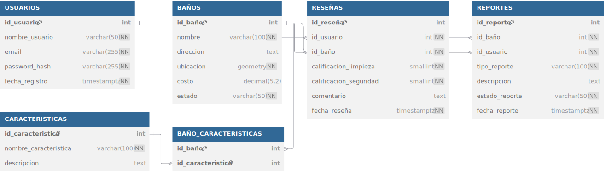

# 3.3. Modelo Relacional

El Modelo Relacional es la traducción lógica del Modelo Entidad-Relación (conceptual) a una estructura formal de tablas, columnas y relaciones que puede ser implementada directamente en un Sistema de Gestión de Bases de Datos (SGBD). Este modelo define con precisión los tipos de datos, las llaves primarias, las llaves foráneas y las restricciones que gobernarán los datos.

Es el esquema definitivo que Sequelize utilizará para generar las migraciones y con el cual la aplicación interactuará.

### Diagrama Relacional (DBML)

El siguiente diagrama, definido en DBML (Database Markup Language), representa el esquema lógico final del proyecto.

### Componentes del Modelo Relacional

- **Tablas (Tables):** Cada entidad del ERD se ha traducido directamente en una tabla con un nombre definido.

- **Llaves Primarias (Primary Keys - PK):** Cada tabla posee una llave primaria para identificar unívocamente cada registro. En la mayoría de los casos, es una columna `id` autoincremental (`SERIAL` en PostgreSQL). La tabla `BAÑO_CARACTERISTICAS` utiliza una **llave primaria compuesta** (`id_baño`, `id_caracteristica`) para asegurar que una característica no pueda ser asignada dos veces al mismo baño.

- **Llaves Foráneas y Relaciones (Foreign Keys - FK):** Las llaves foráneas son el mecanismo que implementa las relaciones y garantiza la integridad referencial.

  - En la tabla `RESEÑAS`, la columna `id_usuario` es una llave foránea que apunta a `id_usuario` en la tabla `USUARIOS`. Esto asegura que cada reseña esté vinculada a un contribuyente válido.
  - Estas relaciones se configuran con reglas como `ON UPDATE CASCADE` (si cambia el ID de un usuario, se actualiza en todas sus reseñas) y `ON DELETE` (define qué sucede si se elimina un usuario, por ejemplo, `SET NULL` para mantener la reseña como anónima o `CASCADE` para borrarla).

- **Tipos de Datos y Restricciones:** A diferencia del ERD, el modelo relacional es explícito con los tipos de datos (`VARCHAR`, `INTEGER`, `TEXT`, `DECIMAL`, `GEOMETRY`, `TIMESTAMPTZ`). También define restricciones a nivel de columna, como `NOT NULL` (el campo no puede estar vacío) y `UNIQUE` (no puede haber dos registros con el mismo valor en esta columna), que son fundamentales para la consistencia de los datos.
