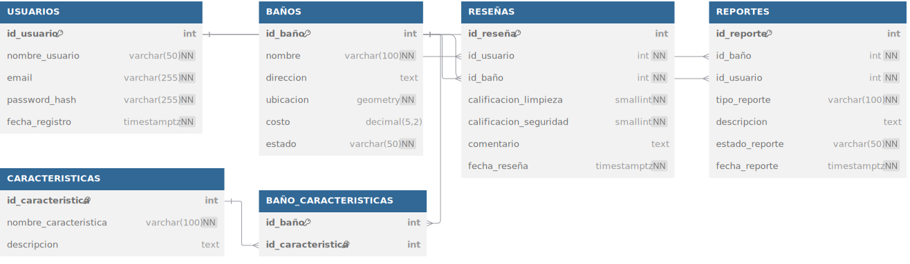

# 3. Esquema de la Base de Datos

El esquema de la base de datos es la estructura formal que define las tablas, sus columnas, los tipos de datos, las llaves primarias, las llaves foráneas y las relaciones entre las tablas. Este diseño ha sido normalizado hasta la Tercera Forma Normal (3NF) y está optimizado para garantizar la integridad, consistencia y eficiencia de los datos.

### Diagrama Relacional (DBML)

El siguiente diagrama fue generado utilizando **DBML (Database Markup Language)**, un lenguaje estándar para definir esquemas de bases de datos. Representa la estructura final del proyecto, incluyendo la lógica de usuarios "Just-in-Time" que mantiene la integridad referencial.

### Descripción de las Entidades y Relaciones

- **`USUARIOS`**: Aunque la interacción del usuario es anónima (solo proporciona un nombre), esta tabla almacena un registro único para cada `nombre_usuario` enviado. La lógica de la API (`findOrCreate`) se encarga de crear un nuevo usuario si no existe, garantizando que todas las contribuciones de "Juan Pérez" apunten al mismo `id_usuario`. Los campos `email` y `password_hash` se rellenan automáticamente para satisfacer las restricciones de la tabla.

- **`BAÑOS`**: Es la entidad central del sistema. Utiliza un campo `ubicacion` de tipo `GEOMETRY` para almacenar las coordenadas, lo que permite consultas espaciales eficientes.

- **`RESEÑAS` y `REPORTES`**: Ambas tablas dependen de `USUARIOS` y `BAÑOS`. La llave foránea `id_usuario` asegura la integridad referencial, vinculando cada contribución a un contribuyente único, mientras que `id_baño` la vincula al baño correspondiente.

- **`CARACTERISTICAS`**: Es una tabla de consulta (_lookup table_) que estandariza los atributos de un baño.

- **`BAÑO_CARACTERISTICAS`**: Es la tabla de unión que implementa la relación muchos a muchos (N:M) entre `BAÑOS` y `CARACTERISTICAS`, permitiendo que un baño tenga múltiples características y que una característica se aplique a múltiples baños. Su llave primaria es compuesta por `(id_baño, id_caracteristica)`.

- **Integridad Referencial:** Las relaciones (`Ref:`) definen explícitamente las llaves foráneas. Por defecto, estas relaciones previenen que se borre un baño o un usuario si todavía tienen reseñas o reportes asociados, protegiendo así la consistencia de los datos.

### **Puntos Clave de este Contenido**

- **Usa DBML:** El código DBML es perfecto porque es tanto un diagrama (cuando se renderiza en `dbdiagram.io`) como una documentación textual precisa y legible. `mdbook` no lo renderizará visualmente, pero lo mostrará como un bloque de código claro.
- **Contextualiza el Diagrama:** El texto que lo rodea explica _por qué_ el esquema está diseñado de esa manera, mencionando la 3NF, la portabilidad y, lo más importante, la lógica de usuarios "Just-in-Time".
- **Describe las Entidades:** El desglose final explica el propósito de cada tabla y cómo las relaciones implementan la lógica de negocio, justificando el diseño.
